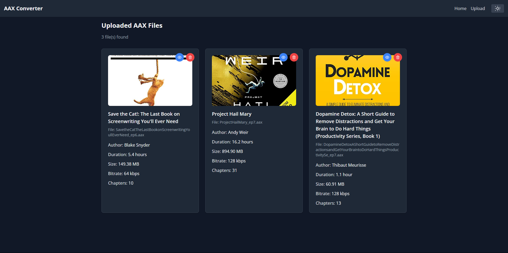
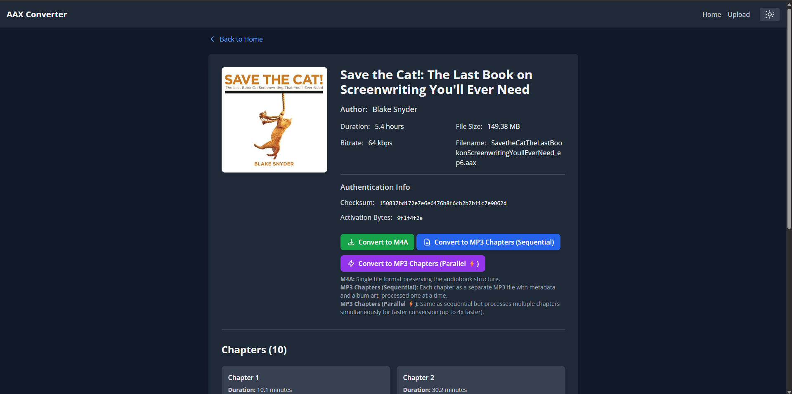

# AAX Converter

A web-based tool for converting and managing Audible AAX audiobook files. This application provides a interface for extracting metadata, activation bytes, and managing your audiobook collection.

## Features

- **Metadata Extraction**: Extract comprehensive audiobook metadata including title, narrator, publisher, duration, and chapters
- **Activation Bytes**: Automatically extract activation bytes required for AAX conversion
- **File Information**: Display detailed file properties including size, checksum, and encoding details
- **Chapter Support**: Extract and display chapter information from audiobooks

## Tech Stack

- **Backend**: FastAPI with Jinja2 templates
- **Frontend**: TailwindCSS with responsive design
- **Processing**: FFprobe for metadata extraction
- **Deployment**: Docker support with dev/prod configurations

## Quick Start

### Local Development

```bash
# Install dependencies
pip install -r requirements.txt

# Run the application
uvicorn main:app --reload

# Access at http://localhost:8000
```

### Docker Development

```bash
docker-compose -f docker-compose.dev.yml up --build
```

## Usage

1. **Upload AAX Files**: Use the web interface to upload your Audible AAX files
2. **View Collection**: Browse uploaded files in the uploads section
3. **Extract Details**: Click on any file to view detailed metadata and activation bytes
4. **File Management**: Delete files directly from the web interface
5. **Convert to M4A**: Convert the AAX file to an M4A file
6. **Convert to MP3 Chapters**: Convert the AAX file to MP3 chapters



